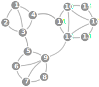
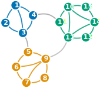
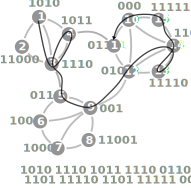
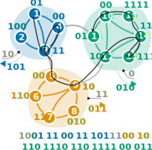
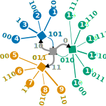
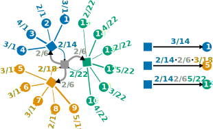

# Map Equation Similarity (MapSim)
This repository implements Map Equation Similarity (MapSim) in Python: an information-theoretic community-based measure for calculating node similarities.
MapSim is explained in [this paper](https://proceedings.mlr.press/v198/blocker22a.html) where it was used for link prediction.

This repository also implements flow divergence, an information-theoretic divergence measure for comparing network, explained in [this paper](https://arxiv.org/abs/2401.09052).

MapSim builds on the map equation for community detection:

## Setup
To get started, create a virtual environment, activate it, and install MapSim.

```bash
# crate the virtual environment
virtualenv mapsim-venv

# activate the virtual environment
source mapsim-venv/bin/activate

# install mapsim with pip
pip install git+https://github.com/mapequation/map-equation-similarity
```


## Usage
MapSim uses Infomap to detect communities, but you can also use other/your own communities.

Let's take the following network:



We can define it directly in python with `networkx`, like so:

```python
import networkx as nx
G = nx.Graph()

G.add_edge( 1,  2, weight = 1)
G.add_edge( 1,  3, weight = 1)
G.add_edge( 1,  4, weight = 1)
G.add_edge( 2,  3, weight = 1)
G.add_edge( 3,  4, weight = 1)

G.add_edge( 5,  6, weight = 1)
G.add_edge( 5,  9, weight = 1)
G.add_edge( 6,  7, weight = 1)
G.add_edge( 6,  9, weight = 1)
G.add_edge( 7,  8, weight = 1)
G.add_edge( 7,  9, weight = 1)
G.add_edge( 8,  9, weight = 1)

G.add_edge(10, 11, weight = 1)
G.add_edge(10, 12, weight = 1)
G.add_edge(10, 14, weight = 1)
G.add_edge(10, 15, weight = 1)
G.add_edge(11, 12, weight = 1)
G.add_edge(12, 13, weight = 1)
G.add_edge(12, 14, weight = 1)
G.add_edge(13, 14, weight = 1)
G.add_edge(14, 15, weight = 1)

G.add_edge( 3,  5, weight = 1)
G.add_edge( 4, 11, weight = 1)
G.add_edge( 9, 12, weight = 1)
```

Then, we use `Infomap` do detect communities:
```python
from infomap import Infomap

im = Infomap(silent = True)
im.add_networkx_graph(G)
im.run()
```

Infomap detects three communities, shown with colours.



Next, we create a `MapSim` instance:
```python
from mapsim import MapSim

ms = MapSim().from_infomap(im)
```

Now we can use `MapSim` to calculate similarities between nodes:
```python
> ms.mapsim(3, 1)
0.21428571428571427
> ms.mapsim(3, 5)
0.007936507936507936
```

We can also ask for similarities between nodes that are *not* connected by a link:
```python
> ms.mapsim(3, 12)
0.01082251082251082
```

Generally speaking, nodes are more similar to each other when they are in the same community.


## How MapSim works
To explain how MapSim works, let's first take a look at how the map equation works.

Let's imagine a random walker who moves on the network and we want to describe where the random walker is after every step.
We can do this by assigning codewords to each node using a [Huffman code](https://en.wikipedia.org/wiki/Huffman_coding) based on the nodes' visit rates.
The general idea is to use shorter codewords for nodes that the random walker visits often and longer codewords for nodes that the random walker visits less often.
Why?
Because we want to describe the random walk efficiently, which means that the codewords should be as short as possible.
A Huffman code does exactly this.



The black trace on the network is a part of a possible random walk and the codewords at the bottom show we would encode it.

But it turns out that we can do better if the network has communities:
We build one Huffman code per community.
Then we can use the same codeword for different nodes in different communities.
Overall, this makes the codewords shorter.
But this has a cost: we also need to say when we leave and enter communities.



We can see that we need fewer bits when we use the codewords that are based on communities.

MapSim uses the same principles as the map equation, but only thinks about one-step walks.
We draw the coding scheme from above in a tree.



Now we can ask: how would we encode a step from node 3 to node 1?
We would use the codeword `01`, which costs 2 bits.
To describe the step from node 3 to node 5, we would use the codeword sequence `101` to exit the blue modules, `11` to enter the orange module, and `00` to visit node 5, which requires 7 bits in total.
And to describe the step from node 3 to node 12 - a link that doesn't exist in the network - we would use the codewords `101` to exit the blue module, `0` to enter the green module, and `10` to visit node 12, that is 6 bits in total.

There's only one more detail:
In practice, we don't simulate random walks or assign actual codewords.
Instead, we use node visit rates and transition rates between nodes.
We draw the same coding scheme from aboce again, but this time, we use transition rates.



How do we read this?
A random walker who is in the blue module visits node 1 with probability $\frac{3}{14}$ and exits module 1 with probability $\frac{2}{14}$.
This means that we get new values for the transitions we considered before:
  * $3 \to 1: \frac{3}{14} \approx 0.214$
  * $3 \to 5: \frac{2}{14} \cdot \frac{2}{6} \cdot \frac{3}{18} \approx 0.008$
  * $3 \to 12: \frac{2}{14} \cdot \frac{2}{6} \cdot \frac{5}{22} \approx 0.011$

These transition rates are the same as above in the "Usage" section.
To "convert" them into costs in bits, we can take their negative $\log_2$:
  * $3 \to 1: -\log_2 \left( \frac{3}{14} \right) \approx 2.22$ bits
  * $3 \to 5: -\log_2 \left( \frac{2}{14} \cdot \frac{2}{6} \cdot \frac{3}{18} \right) \approx 6.98$ bits
  * $3 \to 12: -\log_2 \left( \frac{2}{14} \cdot \frac{2}{6} \cdot \frac{5}{22} \right) \approx 6.53$ bits


## Citation
If you're using MapSim, please cite
```bibtex
@InProceedings{pmlr-v198-blocker22a,
  title     = {Similarity-Based Link Prediction From Modular Compression of Network Flows},
  author    = {Bl{\"o}cker, Christopher and Smiljani{\'c}, Jelena and Scholtes, Ingo and Rosvall, Martin},
  booktitle = {Proceedings of the First Learning on Graphs Conference},
  pages     = {52:1--52:18},
  year      = {2022},
  editor    = {Rieck, Bastian and Pascanu, Razvan},
  volume    = {198},
  series    = {Proceedings of Machine Learning Research},
  month     = {09--12 Dec},
  publisher = {PMLR},
  pdf       = {https://proceedings.mlr.press/v198/blocker22a/blocker22a.pdf},
  url       = {https://proceedings.mlr.press/v198/blocker22a.html},
}
```

And if you're using flow divergence, please cite
```bibtex
@misc{blöcker2024flow,
  title         = {Flow Divergence: Comparing Maps of Flows with Relative Entropy}, 
  author        = {Christopher Blöcker and Ingo Scholtes},
  year          = {2024},
  publisher     = {arXiv},
  doi           = {10.48550/arXiv.2401.09052},
  url           = {https://doi.org/10.48550/arXiv.2401.09052},
  eprint        = {2401.09052},
  archivePrefix = {arXiv},
  primaryClass  = {cs.SI},
  howpublished  = {\href{https://doi.org/10.48550/arXiv.2401.09052}{arXiv:2401.09052}}
}
```